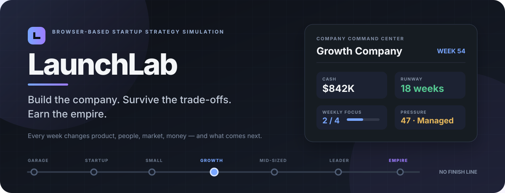
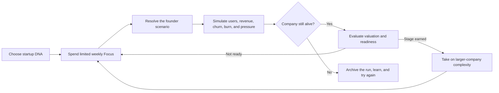
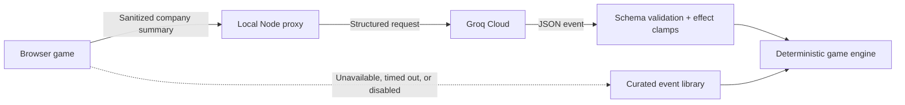

<div align="center">
  
</div>

<h1 align="center">LaunchLab</h1>

<p align="center">
  <strong>A browser-based startup strategy simulation where every decision reshapes the company you are trying to save.</strong>
</p>

<p align="center">
  Build products. Find a market. Hire carefully. Protect runway. Survive the consequences.
</p>

<p align="center">
  
  
  
  
  
  
</p>

---

> Every week gives you a new problem. Every answer fixes something, risks something else, and changes the problems you will face later.

LaunchLab is not an idle clicker and it does not have a single correct build order. It is a connected management game about the uncomfortable decisions behind a growing company:

- Hiring improves capacity but permanently raises burn.
- Lower prices help adoption but weaken revenue quality.
- Shipping quickly creates momentum—and technical debt.
- Growth without support capacity increases churn and operating pressure.
- A large valuation means very little if the company underneath it is fragile.

Your objective sounds simple: **do not run out of cash**. The difficult part is building something worth keeping alive.

## Table of contents

- [Why LaunchLab feels different](#why-launchlab-feels-different)
- [The gameplay loop](#the-gameplay-loop)
- [The systems you manage](#the-systems-you-manage)
- [Choose your startup DNA](#choose-your-startup-dna)
- [Progression must be earned](#progression-must-be-earned)
- [Hard, fair, and endless](#hard-fair-and-endless)
- [Optional Groq events](#optional-groq-events)
- [Run locally](#run-locally)
- [Project structure](#project-structure)
- [Testing and balance](#testing-and-balance)
- [Saves, privacy, and security](#saves-privacy-and-security)
- [Current status](#current-status)

## Why LaunchLab feels different

Most startup games turn growth into a number that always goes up. LaunchLab treats growth as a force that creates new constraints.

| Principle | What it means in play |
| --- | --- |
| **No free snowball** | Growth momentum fades unless the product, market, team, and economics continue to support it. |
| **Limited attention** | Optional management actions share a weekly **Focus** budget. You cannot research, hire, reprice, upgrade, and cut costs all at once. |
| **Scale has a price** | Infrastructure, revenue-linked COGS, payroll complexity, product maintenance, and stage overhead rise with success. |
| **Promotions are proof, not prizes** | Valuation alone cannot advance the company. Readiness must be held across several healthy weeks. |
| **Failure gives warning** | Runway, product health, trust, morale, and pressure expose danger before structural collapse. |
| **The empire is not an ending** | Business Empire is the final named stage, but the simulation continues without a forced victory screen. |

## The gameplay loop



Each week combines two kinds of decisions:

1. **Management moves** — spend Focus on hiring, product work, market research, pricing, campaigns, pivots, or cost control.
2. **The weekly scenario** — make one mandatory founder decision with immediate effects and longer-term consequences.

After the choice, the engine recalculates acquisition, churn, conversion, revenue, COGS, burn, runway, product strain, competition, morale, valuation, pressure, and stage readiness.

## The systems you manage

### Product

Manage a real portfolio rather than a single upgrade bar.

- Create, pause, resume, pivot, price, and improve individual products.
- Balance quality, UX, stability, feature depth, and technical debt.
- Queue multi-week roadmap work such as onboarding, bug fixes, performance, core features, UI/UX, and debt reduction.
- Match roadmap ambition to engineering capacity and team morale.
- Watch weak products turn growth into churn, support load, and reputation damage.

### Team

Build a cross-functional company with five operating roles.

| Role | Primary leverage | Core trade-off |
| --- | --- | --- |
| Engineer | Product quality, stability, shipping capacity | Higher payroll and organizational load |
| Designer | UX, retention, trust | Does not replace engineering or distribution |
| Marketer | Acquisition and campaign execution | Can amplify a weak product too quickly |
| Sales | Conversion, pricing, pipeline | Adds cost before revenue becomes dependable |
| Operations | Efficiency, stability, Focus capacity | Slower short-term expansion for stronger control |

Hiring is not a permanent buff. Team size affects payroll, workload, morale, operating complexity, product support, and projected runway.

### Market

Choose who you serve and why they should care.

- Select a target segment, positioning, and pricing model.
- Run interviews, competitor research, pricing tests, niche campaigns, and community programs.
- Build demand and differentiation while competitors respond to visible success.
- Choose between free, freemium, subscription, one-time, and enterprise monetization.
- Earn market fit through product strength and positioning—not through a single button.

### Finance

Cash is not the same thing as a healthy company.

- Weekly revenue is separated from cash on hand.
- Valuation uses smoothed durable revenue instead of trusting one-off event spikes.
- Burn includes payroll, maintenance, infrastructure, COGS, marketing, optional expenses, and stage overhead.
- Runway is recalculated from the company you have actually built.
- Emergency cost moves consume Focus, so even survival has an opportunity cost.

### Operating pressure

Pressure is the hidden cost of unresolved problems becoming connected.

It rises through churn risk, competition, technical debt, overload, low morale, and weak runway. High pressure damages execution and increases the chance of setbacks. Multiple critical risks left unresolved for three weeks can collapse the company—but recovery before the deadline clears the danger streak.

### Timeline, achievements, and run archive

- Review weekly decisions, deltas, insights, crises, and promotions in the timeline.
- Unlock **26 achievements** across growth, revenue, survival, product, team, market, failure, and special runs.
- Save and resume the active company locally.
- Archive previous attempts, compare runs, and restart from an earlier setup.
- Preserve deterministic run state, including the seeded event sequence, across saves.

## Choose your startup DNA

Every run starts with a business archetype, founder style, and strategic goal. These change starting economics, volatility, and which trade-offs are easiest to absorb.

### Startup archetypes

| Archetype | Character |
| --- | --- |
| **SaaS** | Slower adoption with steadier recurring revenue. |
| **Marketplace** | Difficult early liquidity with stronger late growth potential. |
| **Creator Tool** | Faster initial adoption with less predictable retention. |
| **Agency** | Earlier revenue and safer burn, but limited scaling leverage. |
| **AI Product** | Strong hype potential with expensive infrastructure and higher risk. |

### Founder styles

- **Balanced** — neutral multipliers and fewer extreme swings.
- **Risk-taker** — stronger upside, higher spend, and more volatile outcomes.
- **Conservative** — steadier quality and cash discipline with slower expansion.

### Strategic goals

- **Profit** — prioritize repeatable revenue and financial leverage.
- **Growth** — prioritize users and sustainable acquisition.
- **Stability** — prioritize resilience, quality, trust, and runway.

There is no universally dominant combination. The same decision can be sensible for an agency, fatal for a marketplace, and merely expensive for a SaaS company.

## Progression must be earned

The company can grow through seven named stages:

```text
Garage Startup → Startup → Small Company → Growth Company
      → Mid-Sized Company → Industry Leader → Business Empire
```

A promotion requires all of the following:

- The valuation threshold for the next stage.
- Enough team capacity for that level of operation.
- Safe projected runway after the next stage's costs are applied.
- At least **two of three** readiness pillars: traction, economics, and resilience.
- Several consecutive qualifying weeks.

Promotions happen one stage at a time. A funding windfall cannot skip the operating work between Startup and Industry Leader.

<details>
<summary><strong>Show the stage-readiness targets</strong></summary>

| Promotion to | Valuation | Hold | Users | Durable weekly revenue | Resilience | Runway | Team |
| --- | ---: | ---: | ---: | ---: | ---: | ---: | ---: |
| Startup | $100K | 2 weeks | 50 | $500 | 52 | 4 weeks | 1 |
| Small Company | $1M | 3 weeks | 750 | $4K | 58 | 6 weeks | 2 |
| Growth Company | $5M | 3 weeks | 5K | $20K | 64 | 7 weeks | 4 |
| Mid-Sized Company | $25M | 4 weeks | 25K | $100K | 70 | 8 weeks | 6 |
| Industry Leader | $100M | 4 weeks | 100K | $400K | 76 | 10 weeks | 9 |
| Business Empire | $500M | 5 weeks | 500K | $1.5M | 82 | 12 weeks | 13 |

These values feed the readiness pillars; the engine does not require every target in the table simultaneously. Valuation, team safety, projected runway, and two of the three pillars determine qualification.

</details>

## Hard, fair, and endless

LaunchLab is designed to punish autopilot, not curiosity.

- Positive momentum decays instead of compounding forever.
- User growth is constrained by churn, competition, product health, price friction, and team capacity.
- Conversion has pricing-model-specific ceilings.
- Competitor pressure responds to visibility, differentiation, growth, and operations.
- Stage funding events are limited rather than repeatable sources of free cash.
- Severe losses cannot be hidden behind a small positive metric when outcomes are classified.
- Early unavoidable events cannot erase the entire customer base before the player can respond.
- Restored saves sanitize extreme numeric values so corrupted state cannot create `Infinity` economies.

The last named stage is **Business Empire**, but it is not a finish line. Costs, competition, churn, pressure, and structural failure remain active. The challenge changes from reaching the top to staying there.

## Optional Groq events

LaunchLab is fully playable with its curated event library. Groq is an optional event director that can create occasional state-aware scenarios from the current company situation.

The deterministic JavaScript engine remains authoritative: AI output is validated, clamped, and then processed through the same balance systems as every built-in event.



### Enable Adaptive AI

1. Copy the example environment file:

   ```sh
   cp .env.example .env
   ```

2. Add a newly created Groq credential to `.env`:

   ```dotenv
   GROQ_API_KEY=your_groq_api_key_here
   GROQ_MODEL=openai/gpt-oss-20b
   ```

3. Start or restart the local server:

   ```sh
   npm start
   ```

4. Start or resume a run, open **Settings**, and switch **Adaptive AI** on.

The browser calls `POST /api/ai-event`; only `server.js` communicates with Groq. The server applies request-size limits, input sanitization, per-IP rate limiting, strict response schemas, effect bounds, provider timeouts, and safe fallback behavior.

> **Never put a real API key in `app.js`, `index.html`, LocalStorage, or `.env.example`.** Keep it only in `.env`, which is ignored by Git.

## Run locally

### Requirements

- Node.js **18 or newer**
- A modern desktop or mobile browser
- No database, account, build tool, framework, or `npm install` step

### Recommended: local Node server

```sh
npm start
```

Then open [http://127.0.0.1:3000](http://127.0.0.1:3000).

This mode provides the complete game and enables the optional server-side Groq endpoint.

### Curated-only mode

Open `index.html` directly in a browser. The simulation, achievements, archive, and LocalStorage saves still work, but Adaptive AI requires `server.js`.

### Available commands

| Command | Purpose |
| --- | --- |
| `npm start` | Serve the game and optional AI proxy at `127.0.0.1:3000`. |
| `npm run check` | Syntax-check the server, engine, and test files. |
| `npm test` | Run engine/static integration tests and deterministic balance regression. |

Optional server settings can be changed in `.env`:

```dotenv
HOST=127.0.0.1
PORT=3000
```

## Project structure

```text
LaunchLab/
├── index.html                       # Application shell and accessible UI structure
├── styles.css                      # Responsive dark/light interface and game presentation
├── app.js                          # Simulation engine, state, events, rendering, and saves
├── server.js                       # Static server and optional Groq proxy
├── package.json                    # Local scripts; no runtime packages
├── .env.example                    # Safe server configuration template
├── assets/
│   └── launchlab-readme-banner.svg # Repository-native README artwork
└── tests/
    ├── engine.test.js              # Engine, persistence, DOM-hook, and static integration checks
    └── balance.test.js             # Promotion, numeric safety, Focus, and Monte Carlo regression
```

### Runtime architecture

| Layer | Technology | Responsibility |
| --- | --- | --- |
| Interface | HTML + CSS | Responsive game workspace, navigation, dialogs, timeline, and reports |
| Simulation | Vanilla JavaScript | Deterministic state transitions, economics, products, teams, market, events, and progression |
| Persistence | LocalStorage | Active save, achievements, archives, comparisons, and seeded run position |
| Optional proxy | Node.js built-ins | Static files, security headers, Groq requests, validation, and fallback errors |
| Optional provider | Groq Cloud | Generates structured event ideas from the supplied company state |

## Testing and balance

Run the complete verification suite:

```sh
npm run check
npm test
```

The automated tests cover:

- HTML/JavaScript selector integration and CSS block integrity.
- Product state persistence, paused-product decay, upgrades, and pricing cooldowns.
- Immediate fatal events and idempotent event impact.
- Save migration, LocalStorage failures, and hostile-number sanitization.
- Weekly valuation spike protection and sustained promotion readiness.
- Frozen weekly Focus and prevention of same-week Focus manufacturing.
- Endless weekly advancement without a forced wealth ending.
- Deterministic balance across startup archetypes, founder styles, and goals.

The current autopilot regression runs **45 random, no-management companies** for up to **104 weeks**. **0/45 reach Business Empire.** This is intentionally a floor against passive snowballing—not a target human win rate. A player who researches, reprices, hires, upgrades, and controls costs can progress, but random decisions cannot coast to the top.

## Saves, privacy, and security

### Saves

- Progress is stored in the current browser through LocalStorage.
- There are no accounts, cloud saves, or cross-device synchronization.
- Existing saves are migrated and numeric state is bounded when restored.
- Storage failures fail gracefully instead of crashing the simulation.

### Privacy

Curated play stays in the browser. When Adaptive AI is enabled, a sanitized game-state summary—including the entered startup concept, audience, and niche—is sent through the local Node proxy to Groq so it can create a relevant event.

### Security boundaries

- API credentials remain server-side in `.env`.
- `.env`, dotfiles, server source, and configuration files are blocked from static serving.
- Static paths are normalized and checked against the application root.
- Responses include a Content Security Policy, frame denial, MIME sniffing protection, and a no-referrer policy.
- AI payloads have strict size, shape, rate, timeout, and numeric-effect limits.

The included server is a thoughtful local-development proxy, not an authenticated public production backend.

## Current status

| Area | Status |
| --- | --- |
| Core simulation | Playable |
| Endless stage progression | Implemented |
| Product, team, market, and finance systems | Implemented |
| Local saves, archives, comparison, and achievements | Implemented |
| Curated event engine | Implemented |
| Optional Groq events | Implemented; requires a server-side key |
| Desktop/laptop experience | Fully supported |
| Mobile experience | Fully supported with a compact HUD, touch navigation, and uncluttered responsive views |
| Cloud accounts, sync, and multiplayer | Not included |

## Why this project exists

LaunchLab began with a question:

> Can startup advice become a system you can experiment with instead of a list you simply read?

The project turns concepts such as runway, product-market fit, pricing power, technical debt, hiring leverage, churn, and operating complexity into interacting game mechanics. The aim is not to reproduce real company building perfectly. It is to make the trade-offs legible, consequential, and fun enough that one more week always feels tempting.

If a run fails, that is part of the design. Read the timeline, find the constraint you ignored, and launch again with a better theory.

---
